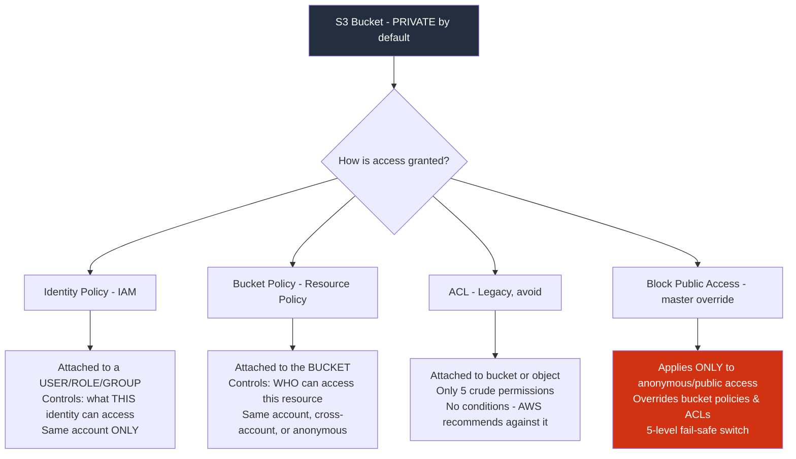
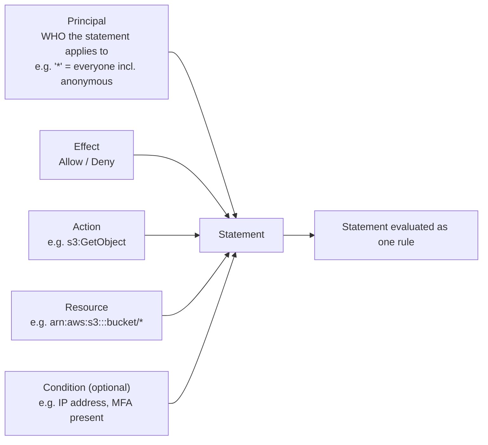
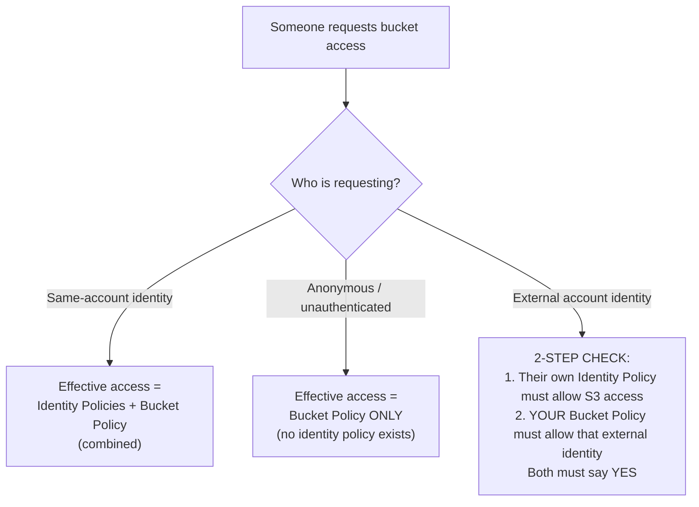
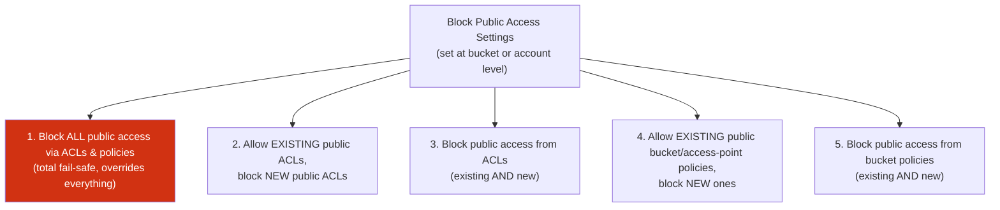
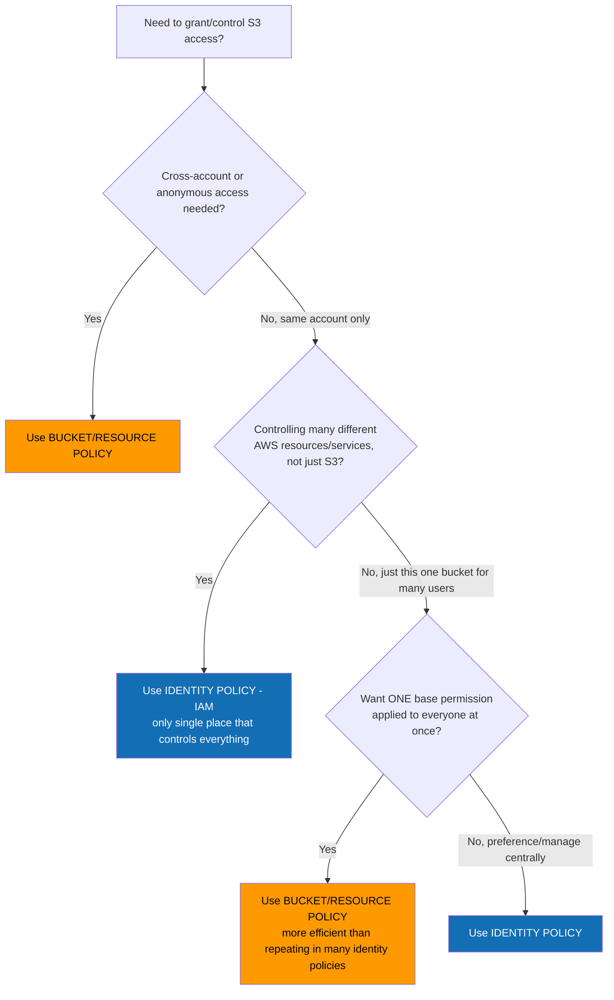

# AWS S3 Security

## 🔑 THE GOLDEN RULE (never forget this)
> **S3 is PRIVATE by default.**
> The only identity with initial access to a bucket = the **Account Root User** of the account that owns it.
> Everything else = access must be **explicitly granted**.

There are **3 ways** to grant access:
1. **Identity Policies** (IAM)
2. **Bucket Policies** (a type of Resource Policy)
3. **ACLs** (legacy — avoid)

Plus one extra guardrail: **Block Public Access** settings.

---

## 🗺️ Master Diagram — How S3 Access Control Fits Together

---

## 1️⃣ Identity Policies vs Resource (Bucket) Policies

| | **Identity Policy** | **Resource (Bucket) Policy** |
|---|---|---|
| Attached to | A user/group/role | The bucket itself |
| Perspective | "What can **this identity** access?" | "**Who** can access this resource?" |
| Scope | **Same account only** | Same account, **cross-account**, or **anonymous** |
| Anonymous access? | ❌ Impossible (must be a valid identity) | ✅ Yes — can use wildcard `*` principal |
| Central management | ✅ Best — IAM is the single place to manage everything | ❌ Must configure per-service/per-resource |
| Best for | Controlling many resources for one identity | Setting a default/base permission for everyone on one resource |

**Rule of thumb:**
- Many resources, one identity → **Identity Policy**
- One resource, many identities (or public/cross-account) → **Bucket Policy**

---

## 2️⃣ Anatomy of a Bucket Policy (Resource Policy)

The key giveaway of a resource policy = it has an explicit **`Principal`** element (identity policies don't need one — the identity IS the principal).

### Example 1 — Public Read Access
- Effect: **Allow**, Principal: **`*`** (anyone, incl. anonymous), Action: **`s3:GetObject`**, Resource: bucket/*
- Meaning: anyone (same account, other accounts, or unauthenticated) can **read/download objects**.

### Example 2 — IP Address Restriction
- **Deny** access to all objects **UNLESS** source IP = `1.3.3.7`
- Uses a `Condition` block with `NotIpAddress`
- If your IP matches → condition not met → Deny doesn't apply → normal access rules take over.

### Example 3 — MFA-Protected Prefix# AWS S3 Security — Complete Notes

## 🔑 THE GOLDEN RULE (never forget this)
> **S3 is PRIVATE by default.**
> The only identity with initial access to a bucket = the **Account Root User** of the account that owns it.
> Everything else = access must be **explicitly granted**.

There are **3 ways** to grant access:
1. **Identity Policies** (IAM)
2. **Bucket Policies** (a type of Resource Policy)
3. **ACLs** (legacy — avoid)

Plus one extra guardrail: **Block Public Access** settings.

---

## 🗺️ Master Diagram — How S3 Access Control Fits Together

---

## 1️⃣ Identity Policies vs Resource (Bucket) Policies

| | **Identity Policy** | **Resource (Bucket) Policy** |
|---|---|---|
| Attached to | A user/group/role | The bucket itself |
| Perspective | "What can **this identity** access?" | "**Who** can access this resource?" |
| Scope | **Same account only** | Same account, **cross-account**, or **anonymous** |
| Anonymous access? | ❌ Impossible (must be a valid identity) | ✅ Yes — can use wildcard `*` principal |
| Central management | ✅ Best — IAM is the single place to manage everything | ❌ Must configure per-service/per-resource |
| Best for | Controlling many resources for one identity | Setting a default/base permission for everyone on one resource |

**Rule of thumb:**
- Many resources, one identity → **Identity Policy**
- One resource, many identities (or public/cross-account) → **Bucket Policy**

---

## 2️⃣ Anatomy of a Bucket Policy (Resource Policy)

The key giveaway of a resource policy = it has an explicit **`Principal`** element (identity policies don't need one — the identity IS the principal).

### Example 1 — Public Read Access
- Effect: **Allow**, Principal: **`*`** (anyone, incl. anonymous), Action: **`s3:GetObject`**, Resource: bucket/*
- Meaning: anyone (same account, other accounts, or unauthenticated) can **read/download objects**.

### Example 2 — IP Address Restriction
- **Deny** access to all objects **UNLESS** source IP = `1.3.3.7`
- Uses a `Condition` block with `NotIpAddress`
- If your IP matches → condition not met → Deny doesn't apply → normal access rules take over.

### Example 3 — MFA-Protected Prefix
- Statement 1: **Deny** access to the `Boris/` prefix (folder) if request is **not using MFA**
- Statement 2: **Allow** read access to the whole bucket
- Because **explicit Deny always wins**, `Boris/` stays MFA-protected while the rest of the bucket is readable.

> 📌 Only **one bucket policy per bucket** — but it can contain **multiple statements**.

---

## 3️⃣ How Access Combines (Very Examinable!)

---

## 4️⃣ ACLs (Access Control Lists) — Legacy, Know It Exists, Don't Use It

- A **sub-resource** attached to a bucket OR an object (not both at once, not groups of objects).
- AWS **actively discourages** ACLs — inflexible, **no conditions**.
- Only **5 permissions** possible:

| Permission | On a Bucket | On an Object |
|---|---|---|
| Read | List all objects in bucket | Read the object + its metadata |
| Write | Overwrite/delete any object | (n/a for objects) |
| Read ACP | Read the ACL itself | Read the ACL itself |
| Write ACP | Modify the ACL itself | Modify the ACL itself |
| Full Control | Read + Write + Read ACP + Write ACP | Same, at object level |

> 🚫 **Exam tip:** Never choose ACLs if another option (identity or bucket policy) is available.

---

## 5️⃣ Block Public Access (BPA) — The Master Override

Introduced after real-world data leaks caused by misconfigured buckets. **Applies only to anonymous/public access** — never affects your own AWS identities.

> 📌 If public access "should" work but doesn't — **check Block Public Access settings first.** This is a very common troubleshooting scenario.

---

## 6️⃣ Exam Power-Up: Decision Cheat Sheet

### Quick memorization rules:
- ✅ **IAM (Identity Policies)** = the **only** place you can control *everything* → default choice for same-account, multi-resource control
- ✅ **Bucket Policies** = needed for **cross-account** or **anonymous** access, or a **single shared base permission**
- ✅ **ACLs** = almost never; legacy; AWS themselves recommend against it
- ✅ **Block Public Access** = the final safety switch that overrides public grants from policies/ACLs — anonymous access only

---

## 📝 One-Paragraph Summary (for quick recall before the exam)
S3 buckets are private by default and owned solely by the account root user. Access is added via **identity policies** (control what an identity can do, same-account only, best when managing many resources from one place) or **bucket/resource policies** (control who can access the resource, support cross-account and anonymous access via the `Principal` element, and are combined with identity policies for same-account access, used alone for anonymous access, and require permission on both sides for cross-account access). **ACLs** are a legacy, inflexible sub-resource-level mechanism (5 permissions, no conditions) that AWS recommends avoiding. **Block Public Access** is a separate, higher-priority safety layer with 5 settings that can fully or partially override any public access granted by policies or ACLs, but only affects anonymous principals.
- Statement 1: **Deny** access to the `Boris/` prefix (folder) if request is **not using MFA**
- Statement 2: **Allow** read access to the whole bucket
- Because **explicit Deny always wins**, `Boris/` stays MFA-protected while the rest of the bucket is readable.

> 📌 Only **one bucket policy per bucket** — but it can contain **multiple statements**.

---

## 3️⃣ How Access Combines (Very Examinable!)

---

## 4️⃣ ACLs (Access Control Lists) — Legacy, Know It Exists, Don't Use It

- A **sub-resource** attached to a bucket OR an object (not both at once, not groups of objects).
- AWS **actively discourages** ACLs — inflexible, **no conditions**.
- Only **5 permissions** possible:

| Permission | On a Bucket | On an Object |
|---|---|---|
| Read | List all objects in bucket | Read the object + its metadata |
| Write | Overwrite/delete any object | (n/a for objects) |
| Read ACP | Read the ACL itself | Read the ACL itself |
| Write ACP | Modify the ACL itself | Modify the ACL itself |
| Full Control | Read + Write + Read ACP + Write ACP | Same, at object level |

> 🚫 **Exam tip:** Never choose ACLs if another option (identity or bucket policy) is available.

---

## 5️⃣ Block Public Access (BPA) — The Master Override

Introduced after real-world data leaks caused by misconfigured buckets. **Applies only to anonymous/public access** — never affects your own AWS identities.

> 📌 If public access "should" work but doesn't — **check Block Public Access settings first.** This is a very common troubleshooting scenario.

---

## 6️⃣ Exam Power-Up: Decision Cheat Sheet

### Quick memorization rules:
- ✅ **IAM (Identity Policies)** = the **only** place you can control *everything* → default choice for same-account, multi-resource control
- ✅ **Bucket Policies** = needed for **cross-account** or **anonymous** access, or a **single shared base permission**
- ✅ **ACLs** = almost never; legacy; AWS themselves recommend against it
- ✅ **Block Public Access** = the final safety switch that overrides public grants from policies/ACLs — anonymous access only

---

## 📝 One-Paragraph Summary (for quick recall before the exam)
S3 buckets are private by default and owned solely by the account root user. Access is added via **identity policies** (control what an identity can do, same-account only, best when managing many resources from one place) or **bucket/resource policies** (control who can access the resource, support cross-account and anonymous access via the `Principal` element, and are combined with identity policies for same-account access, used alone for anonymous access, and require permission on both sides for cross-account access). **ACLs** are a legacy, inflexible sub-resource-level mechanism (5 permissions, no conditions) that AWS recommends avoiding. **Block Public Access** is a separate, higher-priority safety layer with 5 settings that can fully or partially override any public access granted by policies or ACLs, but only affects anonymous principals.
