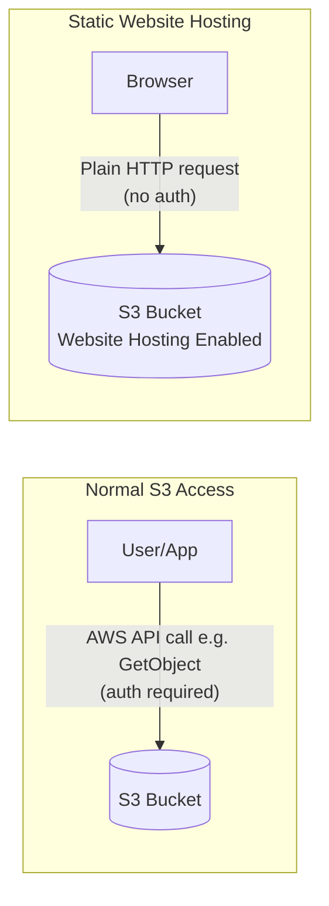
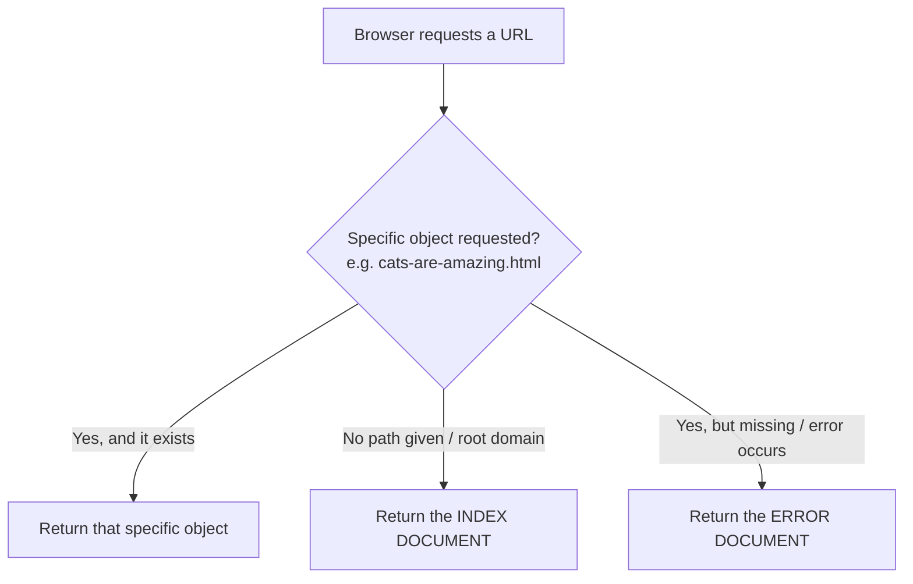
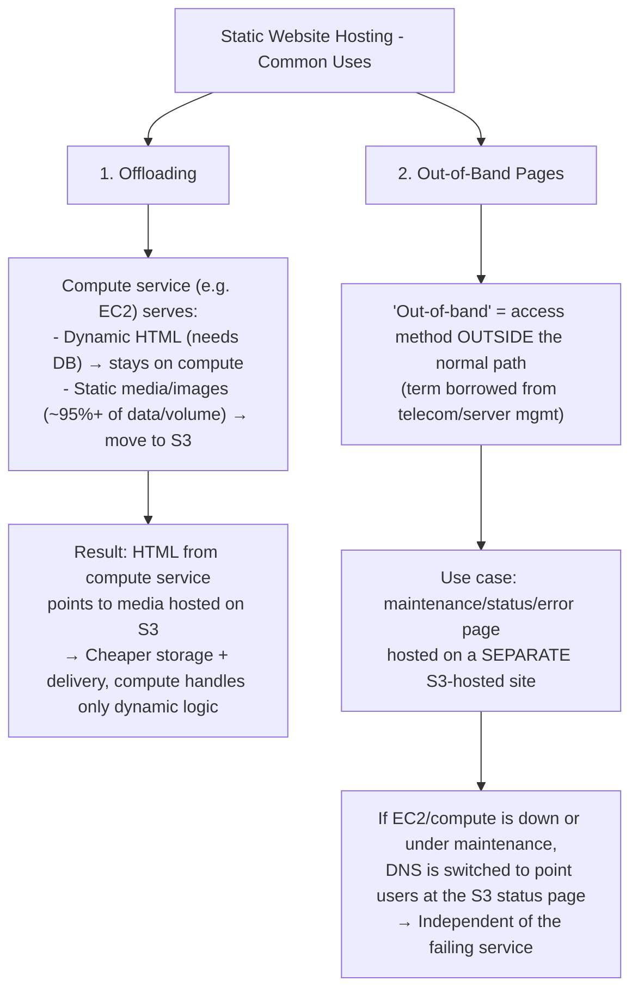
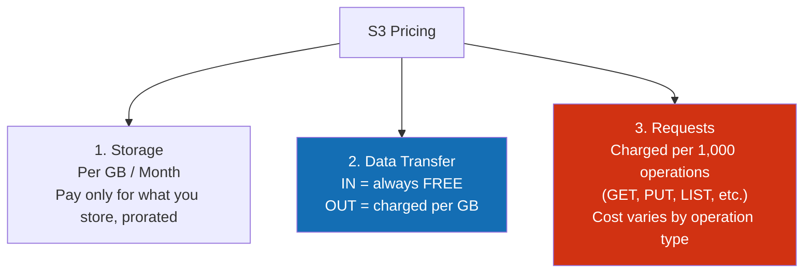

# AWS S3 — Static Website Hosting & Pricing

## 🔑 THE BIG IDEA
Normally S3 is accessed via **AWS APIs** (console, CLI, SDKs all use `GetObject`, `PutObject`, etc. under the hood — secure & flexible, but needs auth).
**Static Website Hosting** flips this: it exposes a bucket over **plain HTTP**, so any browser can access it directly — no AWS auth, no API calls. This turns S3 into a cheap, scalable web host.

---

## 1️⃣ Enabling Static Website Hosting

You must configure **two required documents**, both must be **HTML files**:

| Document | Purpose |
|---|---|
| **Index Document** | Default page shown when no specific object is requested (e.g. visiting `top10animalsforlife.org` → shows `index.html`, like Netflix's homepage) |
| **Error Document** | Shown when something goes wrong — requested file doesn't exist, or a server-side error |

### Website Endpoint
- Enabling the feature auto-generates a **static website hosting endpoint** (a URL).
- Name is generated from **bucket name + region** — you don't choose it.

### Custom Domains
- ✅ You **can** use your own domain (e.g. `top10.animalsforlife.org`)
- ⚠️ **Rule:** the **bucket name must exactly match the domain name**
- 📌 **Practical tip:** reserve website names early by creating S3 buckets with those exact names, even before you're ready to build the site.

---

## 2️⃣ Two Classic Use Cases

**Why offload to S3?**
- Compute services (EC2, etc.) are relatively **expensive**
- S3 is purpose-built for storing large amounts of data cheaply at scale
- 👉 **General rule:** whenever an architecture has large static data, consider offloading it to S3.

**Why out-of-band pages matter:**
- Don't host your status/maintenance page on the *same* server (it's down during maintenance!)
- Don't host it on *another* instance of the *same* compute service either (if EC2 itself has issues, that page could go down too)
- ✅ Host it on **S3 static website hosting** — decoupled from compute entirely, so it stays up even during an outage.

---

## 3️⃣ S3 Pricing — 3 Core Components

| Component | How it's charged | Key note |
|---|---|---|
| **Storage** | $ per GB per month | Cheapest part of S3 — designed for large-scale storage |
| **Data Transfer** | IN: **free** always / OUT: $ per GB | You never pay to upload, only to download/serve |
| **Requests** | $ per 1,000 operations (GET/PUT/LIST/etc.) | ⚠️ Easy to overlook — matters a LOT for high-traffic static websites, since storage/transfer there tend to be small but request volume can be huge |

> 💡 **Why requests matter for static websites specifically:** a small static site doesn't store or transfer much data, but if it gets heavy traffic, the **request count** can be the dominant cost driver.

---

## 4️⃣ Free Tier (relevant to this course/demo)

| Resource | Free Tier Allowance |
|---|---|
| Storage | **5 GB** / month |
| GET requests | **20,000** |
| PUT requests | **2,000** |

> Real-world example from the instructor: personal blog (`courses.io`-style, certification articles, fairly heavy traffic) hosted entirely on S3 static website hosting — **highest monthly bill ever: 17 cents.** S3 is extremely cheap relative to the value delivered.

---

## 📝 One-Paragraph Summary (quick recall)
S3 static website hosting exposes a bucket over plain HTTP (instead of the usual authenticated AWS API access), requiring an **index document** (default/home page) and an **error document** (shown on failures) — both must be HTML. AWS auto-generates a website endpoint based on bucket name + region; a **custom domain requires the bucket name to match the domain exactly**. Two classic use cases: **offloading** static media from an expensive compute service to cheap S3 storage, and **out-of-band pages** — independent status/maintenance pages hosted separately from the main compute service so they stay available during outages. S3 pricing has three parts: **storage** (per GB/month), **data transfer** (free in, paid out per GB), and **requests** (per 1,000 operations) — the request cost is especially important for high-traffic, low-data static sites. Free tier gives 5GB storage, 20,000 GET and 2,000 PUT requests per month.
