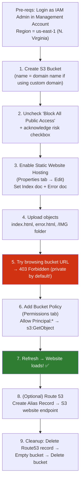

# AWS S3 — Static Website Hosting DEMO Walkthrough

> Companion demo notes to `S3-Static-Website-Pricing-Notes.md`. Covers the hands-on console steps.

## 🖥️ Demo Flow Diagram



---

## Step 1 — Create the Bucket
- Go to **S3 console** → **Create bucket**
- **Bucket name rule:** if you plan to use a custom domain, the bucket name **must exactly match the domain** (e.g. `top10.animalsforlife.io`). Otherwise, any unique name works.
- Scroll down → **uncheck "Block all public access"**
  - ⚠️ This does **not** grant public access — it only *permits* it to be granted later. Two separate steps.
  - Must tick the acknowledgment checkbox confirming you understand the risk.
- Leave everything else default → **Create bucket**

---

## Step 2 — Enable Static Website Hosting
- Open the bucket → **Properties tab** → scroll to bottom → **Static website hosting** → **Edit**
- Choose **"Host a static website"** (not "Redirect requests")
- Set:
  - **Index document** → `index.html`
  - **Error document** → `error.html`
- **Save changes**
- Note the **bucket website endpoint URL** shown at the bottom — copy it, you'll need it.

---

## Step 3 — Upload Objects
- **Objects tab → Upload**
- **Add files** → select `index.html` + `error.html`
- **Add folder** → select the `IMG` folder (contains the images referenced inside `index.html`)
- Confirm destination = your bucket → **Upload**

---

## Step 4 — Test the Website (Expect a 403!)
- Open the website endpoint URL in a new tab
- ❌ Result: **403 Forbidden**
- **Why:** S3 is private by default — enabling static hosting and unchecking Block Public Access does **not** itself grant read permissions. You're an **anonymous/unauthenticated** principal with zero access until explicitly granted.

---

## Step 5 — Grant Access with a Bucket Policy
- **Permissions tab** → **Bucket Policy** → **Edit**
- Paste the generic policy template:
```json
{
  "Version": "2012-10-17",
  "Statement": [
    {
      "Effect": "Allow",
      "Principal": "*",
      "Action": "s3:GetObject",
      "Resource": "arn:aws:s3:::example-bucket/*"
    }
  ]
}
```
- Replace `arn:aws:s3:::example-bucket` with your actual bucket ARN (copy from the top of the policy editor page) — **keep the `/*` suffix**, since it means "all objects in the bucket."
- **Save changes**
- Refresh the website tab → ✅ site now loads (e.g., loading `index.html` → which pulls images from `/IMG/`)
- Try a nonexistent page (e.g. `wrongindex.html`) → **error.html** is served instead.

---

## Step 6 — (Optional) Custom Domain via Route 53
- Requires a domain already registered/hosted in Route 53.
- **Route 53 → Hosted zones → your domain → Create record**
- Choose **Simple routing** → **Define simple record**
  - **Record name** = the subdomain portion (e.g. `top10`)
  - **Endpoint type** = **Alias to S3 website endpoint**
  - Select your **region** (us-east-1) → your bucket should appear in the dropdown
  - ⚠️ If your bucket doesn't show up: wrong region, or the record name + domain doesn't exactly match the bucket name
- **Create records** → wait briefly → access site via your full custom domain (FQDN)

---

## Step 7 — Cleanup
1. Route 53 → delete the alias record
2. S3 → select bucket → **Empty** (type `permanently delete` to confirm)
3. S3 → select bucket → **Delete** (type bucket name to confirm)

---

## 📝 Key Takeaways from This Demo
- Static website hosting ≠ automatic public access — **Block Public Access off** + **Bucket Policy allowing `s3:GetObject` to `Principal: "*"`** are both required.
- The **403 Forbidden** step is intentional — it reinforces "S3 is private by default," even with hosting enabled.
- Custom domain support **requires the bucket name to equal the FQDN** exactly — this is why reserving names early matters.
- Route 53's **"Alias to S3 website endpoint"** record type is what links your domain to the bucket (not a plain CNAME).
