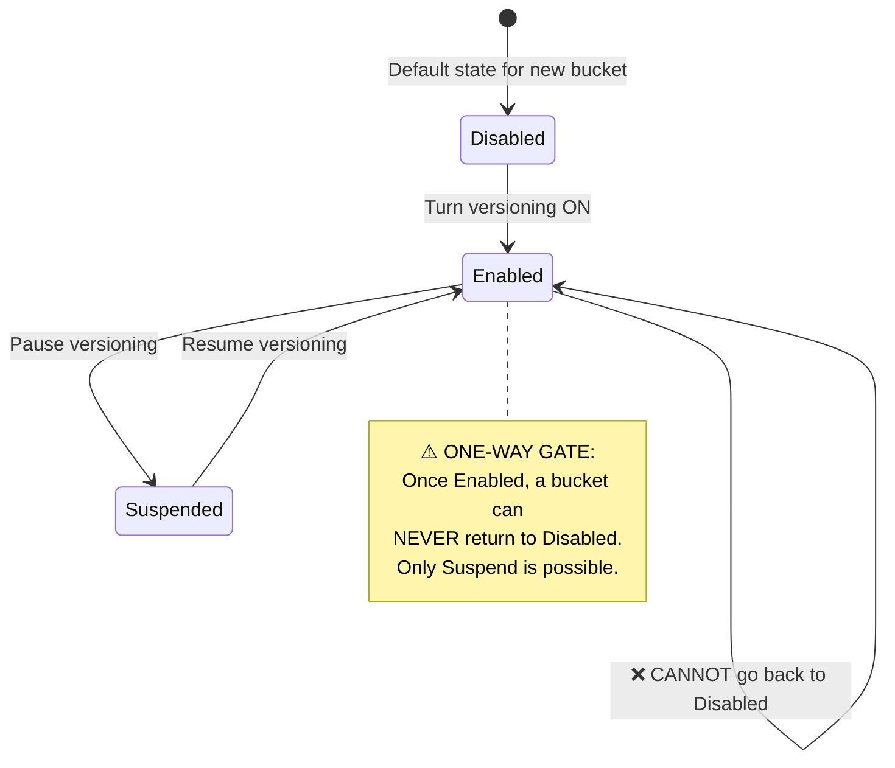
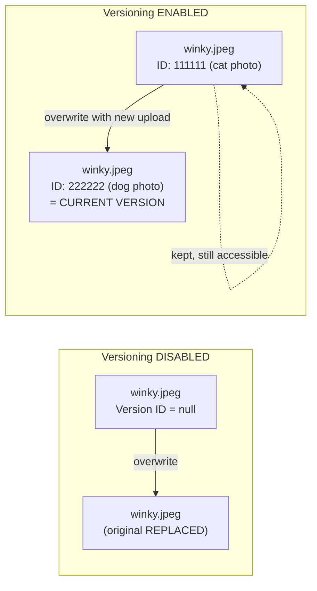
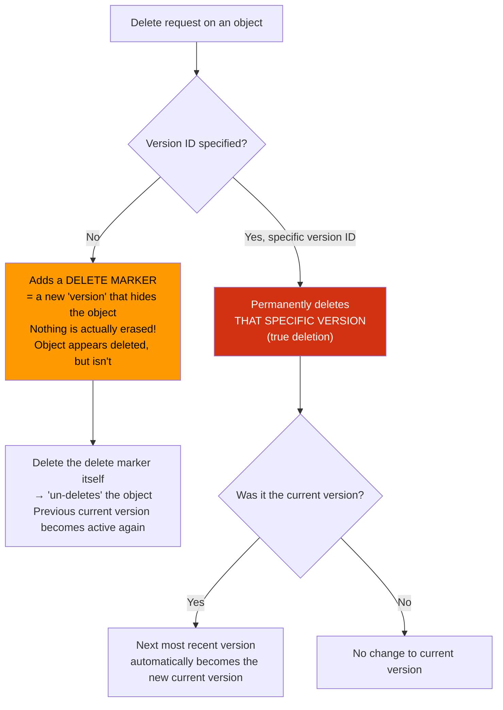
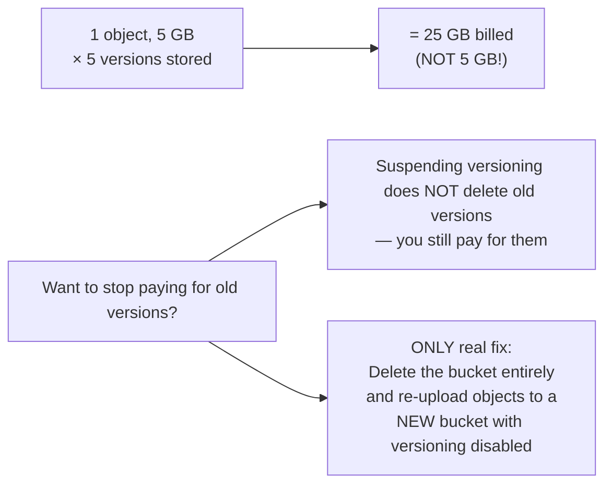
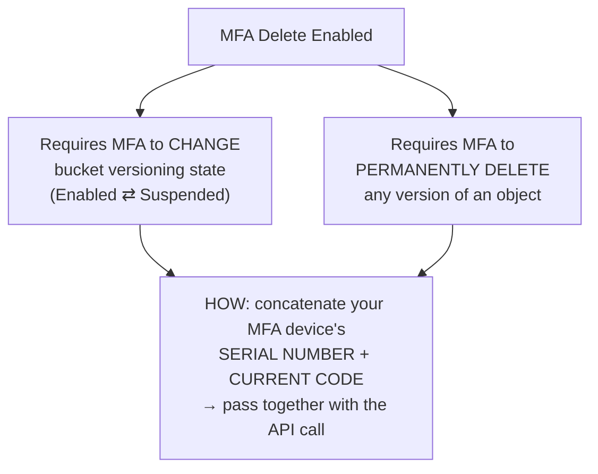

# AWS S3 — Object Versioning & MFA Delete

## 🔑 THE BIG IDEA
Versioning lets a bucket store **multiple versions of an object** instead of overwriting it. It's a **bucket-level** setting, and it has a **one-way gate**: once **Enabled**, it can never go back to **Disabled** — only **Suspended**.

---

## 1️⃣ Versioning States — The State Machine (HIGH EXAM PRIORITY)

> 📌 **Memorize this exactly** — it's a classic trick-question topic:
> - Disabled → Enabled ✅
> - Enabled → Suspended ✅
> - Suspended → Enabled ✅
> - Enabled → Disabled ❌ **NEVER POSSIBLE**

---

## 2️⃣ How Objects Work Without vs. With Versioning

| | **Versioning OFF (Disabled)** | **Versioning ON (Enabled)** |
|---|---|---|
| Object identifier | Key (name) only | Key **+ Version ID** |
| Version ID value | Always `null` | Unique ID auto-assigned per version (e.g. `111111`) |
| Modify/overwrite object | Original is **replaced/lost** | Original is **kept**; new version created |
| Delete object | Object is **gone** | A **delete marker** is added (nothing is actually erased) |

---

## 3️⃣ "Current Version" Concept
- The **most recently uploaded** version = the **current version**.
- If you request an object **without specifying a version ID** → you always get the **current version**.
- If you want an older version → you must **explicitly provide its version ID**.

---

## 4️⃣ Deletion Behavior — Delete Markers vs. Real Deletes

**Key facts:**
- **Simple delete (no version ID)** = "soft delete" → adds a **delete marker**, a special hidden-object version. Reversible.
- **Delete + specific version ID** = "hard delete" → permanently removes that exact version. Not reversible.
- Deleting the current version → the **next-most-recent version is promoted** to current.
- Deleting the delete marker itself = **restores/un-deletes** the object.

---

## 5️⃣ ⚠️ Cost Warning — Why You Can't Just "Turn It Off"
Because Enabled can never go back to Disabled, **every version of every object stays in the bucket and keeps costing money**.

> 💡 **Exam tip:** "Suspend" ≠ "cleanup." Old versions remain and are still billed. The only way to zero out version storage cost is deleting the bucket and starting fresh.

---

## 6️⃣ MFA Delete — Extra Protection Layer

MFA Delete is configured **as part of the versioning configuration** on a bucket.

**Two things MFA Delete protects:**
1. Changing the bucket's versioning state (Enabled ↔ Suspended)
2. Permanently deleting a specific object version

**How it works technically:**
- You provide: `MFA device serial number` + `current MFA code`, concatenated together
- This is passed along with the relevant API call

---

## 📝 One-Paragraph Summary (quick recall)
S3 object versioning is a bucket-level feature that starts **Disabled**, can be **Enabled**, and from Enabled can only be moved to **Suspended** (and back) — it can **never return to Disabled**. Without versioning, objects have a `null` version ID and modifications overwrite the original; with versioning, every write creates a new version with a unique ID, the newest being the **current version**, and old versions remain accessible by ID. Deleting without specifying a version adds a **delete marker** (a reversible "soft delete" that hides the object); deleting a specific version ID performs a **permanent, unrecoverable delete**, and if that was the current version, the next-most-recent version is promoted. Because old versions are never automatically removed, storage costs accumulate — the only way to reset this is deleting and recreating the bucket. **MFA Delete**, configured within the versioning settings, adds a required MFA device serial number + code to any API call that changes the bucket's versioning state or permanently deletes an object version.
