# AWS S3 — Versioning & Delete Markers DEMO Walkthrough

> Companion demo notes to `S3-Versioning-MFA-Delete-Notes.md`. Covers the hands-on console steps.

## 🖥️ Demo Flow Diagram

```mermaid
flowchart TD
    S0["Pre-reqs: Management account, IAM admin<br/>Region = us-east-1"] --> S1
    S1["1. Create bucket + uncheck Block Public Access<br/>+ ENABLE VERSIONING at creation"] --> S2
    S2["2. Enable static website hosting<br/>(index.html / error.html)"] --> S3
    S3["3. Apply bucket policy<br/>(Principal:* → s3:GetObject)"] --> S4
    S4["4. Upload index.html + IMG/winky.jpeg (v1)"] --> S5
    S5["5. Confirm site loads correctly (real Winky)"] --> S6
    S6["6. Upload a DIFFERENT file, SAME name winky.jpeg<br/>(the Truffles photo) → creates v2"] --> S7
    S7["7. Refresh site → wrong photo loads<br/>(S3 always serves the CURRENT/latest version)"] --> S8
    S8["8. Toggle 'Show versions' → see v1 (Winky) + v2 (Truffles)"] --> S9
    S9["9. Delete object (no version specified)<br/>→ adds a DELETE MARKER, doesn't erase anything"] --> S10
    S10["10. Delete the delete marker itself<br/>→ object 'un-deleted', back to v1+v2"] --> S11
    S11["11. Select the WRONG version (Truffles, v2) specifically<br/>→ permanently delete THAT version"] --> S12
    S12["12. Next most recent version (Winky, v1) auto-promoted to current"] --> S13
    S13["13. Refresh site → correct photo loads ✅"] --> S14
    S14["14. Cleanup: Empty bucket → Delete bucket"]

    style S7 fill:#d13212,color:#fff
    style S9 fill:#ff9900,color:#000
    style S13 fill:#2e7d32,color:#fff
```

---

## Step 1 — Create the Bucket (with Versioning ON)
- **S3 console → Create bucket**
- Pick any unique name (no custom domain needed for this demo)
- Uncheck **Block all public access** → acknowledge the risk
- Under **Bucket Versioning** → click **Enable**
- **Create bucket**

---

## Step 2 — Enable Static Website Hosting
- Bucket → **Properties tab** → scroll down → **Static website hosting → Edit**
- Enable → **Host a static website**
- Index document: `index.html` / Error document: `error.html` → **Save changes**

---

## Step 3 — Add the Bucket Policy
- **Permissions tab → Bucket Policy → Edit**
- Paste the generic `bucket_policy.json` template
- Replace the placeholder ARN (keep the `/*` suffix) with your actual bucket ARN → **Save changes**
- This grants anonymous `s3:GetObject` access — required for the website to be publicly readable.

---

## Step 4 — Upload the First Version
- **Objects tab → Upload**
- **Add files** → `index.html`
- **Add folder** → `IMG` (contains `winky.jpeg` — the real Winky photo, **version 1**)
- Upload → open the website endpoint URL → confirms the real Winky photo displays correctly.

---

## Step 5 — Upload a "Mistake" Second Version
- Go into the **IMG/** folder in the console → **Upload → Add files**
- Select the *Truffles* photo but keep the filename **`winky.jpeg`** (same key, different content)
- Upload → this does **not overwrite** — it creates **version 2** of the same object key.
- Refresh the live website → ❌ **wrong photo (Truffles) now displays**, because S3 always serves the **current (latest) version** by default.

---

## Step 6 — Reveal the Versions
- In the **Objects** list, toggle **"Show versions" → ON**
- You'll now see **two entries for `winky.jpeg`**, each with a distinct **Version ID**:
  - Bottom = original (Winky) — no longer current
  - Top = newest (Truffles) — current version

---

## Step 7 — Delete Without Specifying a Version (Soft Delete)
- With "Show versions" ON, select `winky.jpeg` → **Delete**
- Console warns: *"Deleting the specified objects adds delete markers to them."*
- Confirm by typing `delete` → **Delete objects**
- With "Show versions" OFF → object **appears** gone (delete marker hides it)
- With "Show versions" ON → you now see **3 entries**: original v1, mistaken v2, and a new **Delete Marker** on top

---

## Step 8 — Undo the Delete (Remove the Delete Marker)
- Select just the **Delete Marker** entry → **Delete**
- ⚠️ This action is **permanent** — you must type `permanently delete` to confirm
- Result: the delete marker is removed → object is "**un-deleted**" → back to having v1 + v2 visible
- Refresh website → still shows Truffles (the mistake is still the current version — un-deleting doesn't fix *which* version is current)

---

## Step 9 — Permanently Remove the Wrong Version
- With "Show versions" ON, select **specifically the Truffles version** (the current/most recent one)
- **Delete** → confirm with `permanently delete` (this is a true, irreversible deletion of that version)
- Effect: the **next most recent version** (the real Winky, v1) is **automatically promoted** to current version.

---

## Step 10 — Confirm the Fix
- Refresh the live static website → ✅ correct Winky photo now loads.
- Toggle "Show versions" OFF → only one object remains: the original, correct version.

---

## Step 11 — Cleanup
1. S3 console → select bucket → **Empty** (type `permanently delete` to confirm)
2. Select bucket again → **Delete** (type bucket name to confirm)

---

## 📝 Key Takeaways from This Demo
| Action (on an **object**, no version specified) | What actually happens |
|---|---|
| Upload same key again | Creates a **new version**, doesn't overwrite |
| Delete | Adds a **delete marker** (soft, reversible) |

| Action (on a **specific version ID**) | What actually happens |
|---|---|
| Delete a specific version | **Permanent**, irreversible |
| Delete the delete marker | Un-deletes the object |
| Delete the *current* version specifically | Next-most-recent version is auto-promoted to current |

- The console's default view (Show Versions = OFF) hides the full picture — always toggle it ON when diagnosing "disappeared" or "wrong" objects in a versioned bucket.
- Versioning **cannot be disabled**, only suspended — and suspending does **not** delete old versions, so **costs keep accumulating** unless you manually purge versions or delete/recreate the bucket.
